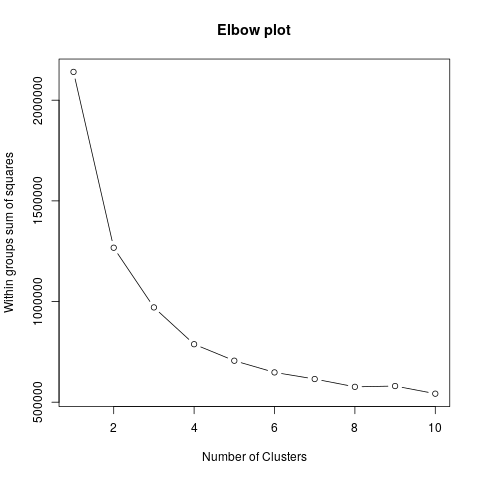
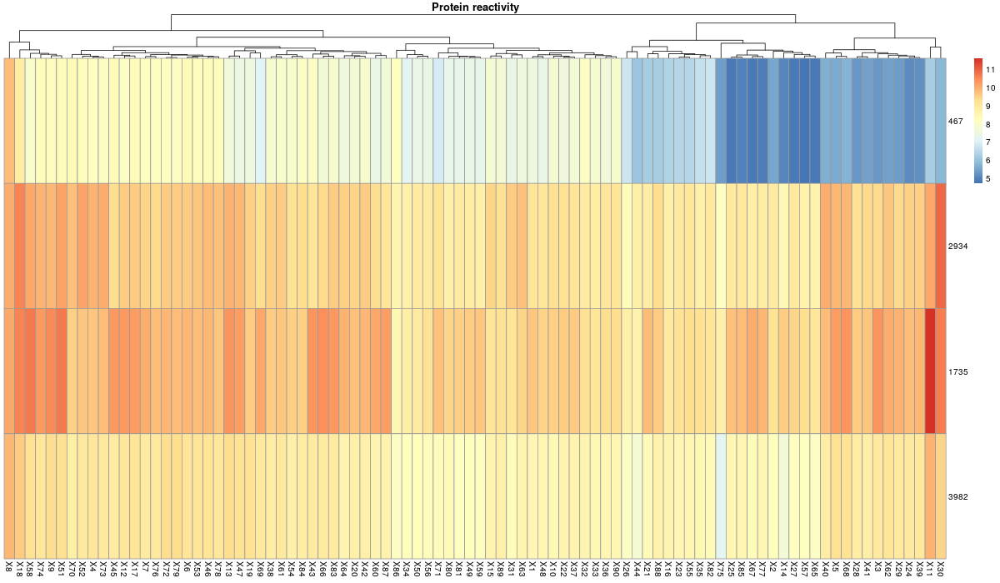
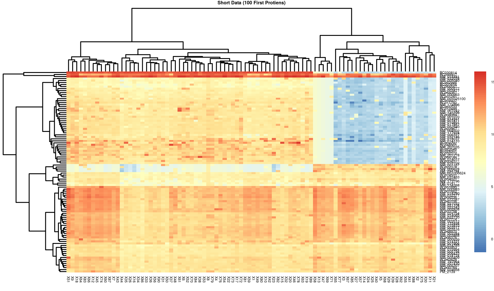
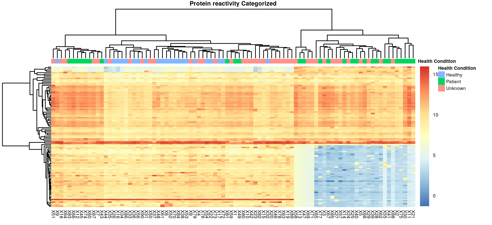
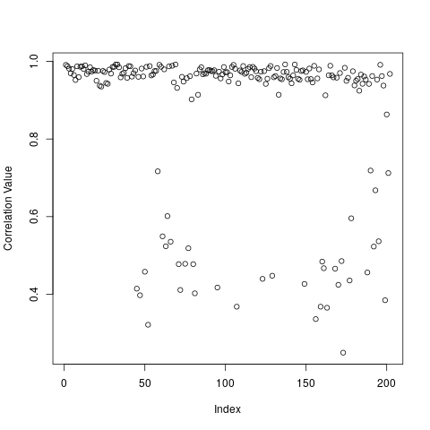
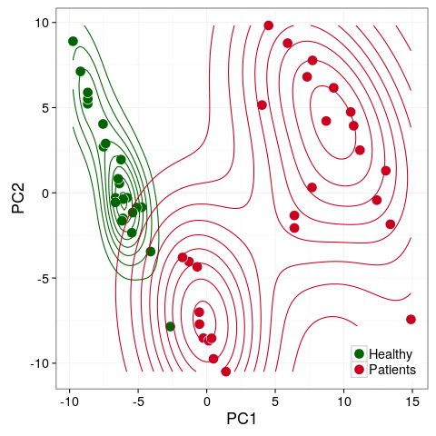
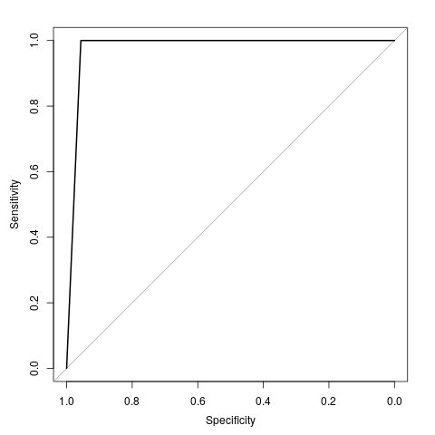

> ### Learning Objectives
>
> - Get familiar with R and RStudio
> - Learn and understand the importance of exploratory analysis
> - Perform basic unsupervised learning task - clustering and learn how to use its results (in case of bioinformatics data)
> - Get your data ready for the modeling step. Learn one of the most basic feature selection methods in bioinformatics - differential expression analysis
> - Visualize your data projected on first two principle components and validate the quality of your data
> - Use `caret` library for training different machine learning models via cross validation pipeline on training data and use `predict` function to generate predictions for the testing data
> - There are 8 core exercises and 3 bonus exercises. Core exercises are worth 10 points and bonus exercises will give you another 7 points (+ 1 hidden). So in total you can get 18 points for this homework.
> - In order to claim points for the exercise, read the task carefully and answer all the questions/requests. Support your answers with your own interpretation.

Before we start. Load all necessary libraries (expand this list later if needed):

```{r, echo=TRUE}
library(pheatmap)
library(ggplot2)
library(amap)
library(caret)
library(gProfileR)
```

In order to help you develop hands on skills in bioinforamtics data analysis, we will use a data set, derived from the real biological study on Alzheimer's disease (Diagnosis of Alzheimer's Disease Based on Disease-Specific Autoantibody Profiles in Human Sera: http://journals.plos.org/plosone/article?id=10.1371/journal.pone.0023112).

Columns of this data set represent people that participated in the study and rows are protein reactivities (some sort of measurement we can compute for all people).

Access the data set we prepared for you:

```{r, eval=FALSE}
data <- read.table(file = 'Data/data.csv', sep = ',')
```

### Exploratory analysis and logarithmisation

To get a glimpse of your data, print the first six rows using function `head()`:

```{r, eval = FALSE}
head(data)

# also you can use str(), dim() and summary()
```
> #### Exercise 1 (1 point)
>
> Based on the output of `str(data)`, `dim(data)` and `summary(data)`, can you answer the following questions?
>
>* What is the class of the object `data`?

```{r, echo=TRUE, eval = FALSE}
str(data)
"data.frame" First line of the command str(data)
```
>* How many rows and how many columns are in this object?

```{r, echo=TRUE,eval=TRUE}
dim(data)
#(9118,90) (rows,columns).
```

>* What type of data is stored in this object? (character, numeric, integer, etc.)

```{r, echo=TRUE, eval = FALSE}
str(data)
#All the values are numerical.
```
>* What are the first two values in the sample `X13`?

```{r, echo=TRUE, eval = FALSE}
data$X13[1:2]
#First : 129.0138
#Second: 212.7461
str(data$X13)
# First : 129
# Second: 213
```
>* What is the mean reactivity value for a sample `X75`?

```{r, echo=TRUE, eval = FALSE}
mean(data$X75)
#546.6452
summary(data$X75)
#546.60
summary(data)
#546.65
```

You can understand data better if you visualise it. Let's plot it using `pheatmap` function (make sure you have loaded an appropriate library first)

```{r, echo=TRUE, eval = FALSE}
pheatmap(data[1:1000,], cluster_rows = FALSE, cluster_cols = FALSE, show_rownames = FALSE)
```

As you can see, it takes a lot of time for your computer to plot a heatmap this big (9118 by 90). Currently the most time consuming part is to display this huge matrix on your screen in RStudio, but if you save this image directly to the file, it won't take a lot of time.

```{r, echo=TRUE, eval = FALSE}
pheatmap(data[1:1000,], cluster_rows = FALSE, cluster_cols = FALSE, show_rownames = FALSE, 
         filename = 'Images/phmap1.png')
```

Ok, it still took some time :)

Use `log2()` function to log scale your data and save it into a new variable `data_log`.

```{r, eval=FALSE}
data_log <- log2(data)
```

Plot logarithmised data using `pheatmap` function.

```{r, eval = FALSE}
pheatmap(data_log, cluster_rows = FALSE, cluster_cols = FALSE, show_rownames = FALSE)
pheatmap(data_log[1:1000,], cluster_rows = FALSE, cluster_cols = FALSE, show_rownames = FALSE,
         filename = 'Images/phmap2.png', fontsize = 5)
```

Trust me, this the last time we have to plot heatmaps like these.

> #### Exercise 2 (1 point)
>
> Looking at `phmap1.png` and `phmap2.png` that now should be stored in your `Images/` folder, attempt to answer the following questions:
>
>* Name main differences (at least 3) that you see between graphs

1. The scale range is much different now (one of the reasons for using log plot is when we have large range of quantities [Source](https://en.wikipedia.org/wiki/Logarithmic_scale))
2. The values more distinguishable.
3. The values are closer to each other which give better coloring.
4. With the new heatmap we can observe things we couldn't see before. Due to one of logarithm properties (small step on small x get large difference on y)(example : log2(0.1)= -3.32 , log2(0.2)=-2.32, log2(1000000)= 16.6, log2(500000)= 18.93)

>* Do you see vertical and horizontal lines that are now visible on the second image? Can you explain what are those and why they have become visible after `log2()`?

Those for people (in case of columns) who have (high/low) protein reactivities compared to there neighbours mainly. while the rows represent a (high/low) reactivities for specific protien compared to there neighbours mainly.
They are pretty clear now because with log as I mentioned in the previous request we get closer values when protein reactivities get higher and we get more distributed values when the protein reactivities get smaller. I believe that's the reason for it.


### Unsupervised learning. Cluster analysis.

In biology everything is connected, and there is a very little space for coincidences. Similar things act in a similar way. As we study protein reactivities, we might be potentially interested in capturing proteins that behave in similar fashion. In order to find potentially interesting groups of proteins, we would perform a cluster analysis. 

During the practice session after the lecture on unsupervised learning, Elena has introduced two clustering methods that are very popular in bioinformatics: `kmeans` and `hierarchical` clustering. Let's start with `kmeans`.

In order to work with `kmeans` clustering, one has to choose an appropriate number of clusters, which he/she anticipates to find in the data. To estimate the number of clusters, Elbow plot is used (check lecture slides and/or https://en.wikipedia.org/wiki/Determining_the_number_of_clusters_in_a_data_set). 
Here is a snippet of code that generates an Elbow plot.

```{r, echo=TRUE, eval = FALSE}
# Calculate the sum of squared distances from cluster members to 
# centers for ten possible number of clusters
wss <- sapply(1:10, function(x) sum(kmeans(data_log, centers=x)$withinss))

# Visualise the sum of the squared distances from cluster 
# members to centers for all ten possible number of clusters 
png('Images/elbow.png')
plot(1:10, wss, type="b", xlab="Number of Clusters",
     ylab="Within groups sum of squares", main = 'Elbow plot') 
# you can use Zoom button to take a closer look at generated graph
dev.off()
```



> #### Exercise 3 (1 point) 
>
> Choose number of clusters `k` by looking at the Elbow plot you have just created. Remind
yourselves that an appropriate number of clusters is the number at which the reduction in SSE decreases dramatically. This produces a bending point in the Elbow plot.

```{r, eval = FALSE}
k <- 4 # Select more meaningful k by looking at Elbow plot 

# Enable reproducibility
set.seed(1234)

# Run kmeans (check lecture slides) clustering to find clusters in our data
km <- Kmeans(x = data_log, centers = k, iter.max = 100, method = "correlation")

# Explore the structure of clustering
head(km)
png(filename = 'Images/protienre.png',width = 1200,height = 700)
pheatmap(data.frame(km$centers), labels_row = km$size, 
         cluster_rows=F, cluster_cols=T,
         clustering_distance_rows = "correlation",
         border_color = "grey60",
         main="Protein reactivity")
dev.off()
```

> #### Exercise 4 (2 points) 
>
> Look at the heatmap you have just generated in the last step. Row names indicate the number of proteins in each corresponding cluster. Proteins that are clustered together might share similar function(s). We can use `gprofiler` tool to find this function(s).
For example, select a cluster (row), which seems to have at least two distinguished groups of samples, and run the following code: 

```{r, eval = FALSE}
cluster_id <- 1 # choose a cluster you would like to analyse

# print out protein names that belong to this cluster
names(km$cluster[which(km$cluster == cluster_id)])

# use gProfiler (here is a web interface: http://biit.cs.ut.ee/gprofiler/)

# to identify a pool of most probable common biological functions for 
# chosen group of proteins
gp_results <- gprofiler(names(km$cluster[which(km$cluster == cluster_id)]))[,c(3,12)]
head(gp_results)
# print first 6 most significant (p.value is the lowest) terms
# use function `arrange` from dplyr library to arrange gp_results by
# p.value. Use function `head` to print only first 6 rows.  
library(dplyr)
View(head(arrange(gp_results,p.value)))

#  p.value   term.name 
#1 0.00220   cytoplasm
#2 0.00229   protein binding
#3 0.00341   vitamin metabolic process
#4 0.00597   Leishmaniasis
#5 0.00788   HUMAN IMMUNODEFICIENCY VIRUS TYPE 1, SUSCEPTIBILITY TO;;HIV-1, 
#SUSCEPTIBILITYTOHUMAN IMMUNODEFICIENCY VIRUS TYPE 1, RESISTANCE TO, INCLUDED
#;;HIV-1, RESISTANCE TO,INCLUDED;;ACQUIRED IMMUNODEFICIENCY SYNDROME, 
#PROGRESSION TO, INCLUDED;;AIDS, PROGRESSION TO, INCLUDED
#6 0.00889   regulation of smooth muscle cell proliferation
```
> In order to claim 2 points for this exercise, report heatmap of clusters, tell which of the clusters you decided to investigate and print out first six most significant terms associated with this cluster.

I choosed to go with K=4 and that's because I calculated the differencess between wss[i]-w[i+1] and found that at i=4 (the cut point) the difference got big differences from the previous differenceses. (it's also shown in the elbow plot)



^_^

### Feature selection

Feature selection is an important step that allows us to significantly reduce dimensionality of our data. There were many methods developed in bioinformatics (and elsewhere) for an efficient feature selection.

Before diving into the feature selection methods, we need to utilise another piece of relevant information that so far has been hidden - training labels. For that, let's read in the file that contains them:

```{r,eval=FALSE}
trainingLabels <- read.table('Data/trainingLabels.csv', sep = ',', header = TRUE)

# Print first six 
head(trainingLabels) 
```

There are two columns in this file: `array` for sample name, and `label` for class variable (0 - healthy, 1 - patient). Let's count how many patients and healthy people we have in our `trainingLabels`:

```{r,eval=FALSE}
table(trainingLabels$label)
```

Notice that some samples are missing from this list (e.g. there is no label for a sample `X3` etc.). This is because in `trainingLabels.csv` we have included (you guessed it!) only labels for the training set (50 samples), other 40 labels you will have to predict using Machine Learning methods that will be introduced later. For now let's use information only from the given set of 50 samples.

#### Differential expression analysis 

The idea of differential expression analysis is to select proteins that are most different between patients and healthy subjects. It turns out that these differentially expressed proteins suit nicely as features for training our models. 

In order to perform this analysis, we need to know, which subjects in our study are sick and which are healthy. For that we shall identify and separately store indexes of sick and healthy subjects.

```{r, eval = FALSE}
  library(dplyr)

# Store separately indexes of patient and healthy samples
patients <- which(colnames(data_log) %in% filter(trainingLabels, label == 1)$array)
healthy <- which(colnames(data_log) %in% filter(trainingLabels, label == 0)$array)

# Spooky code, I know, it is ok, don't worry, you won't have to write it yourself
```

During the lecture we saw that in order to perform differential expression analysis, one should compute standard error (SE) of two samples, degrees of freedom (DF) and means of both samples. In R everything has been implemented by `t.test` function. It only needs to know what are the values of the first and the second class, the rest it will compute by itself:

```{r, eval=FALSE}
# Compute p.values for all 9118 protein in our data
# function apply() is very similar to the for loop, but works much faster in R
pvalues <- apply(data_log, 1, function(x) t.test(x[patients], x[healthy])$p.value)

# Take a look at first 6 p.values
head(pvalues)
```

We have produced a vector of probabilities. These probabilities could be interpreted as - 'what is the chance that reactivities of this protein (i.e values of this feature) are `not` significantly different between two conditions (sick and healthy). Here is a special emphasis on `not` significantly different. This means - smaller this probability, more likely it is that this protein `is` different enough between two conditions, and more likely we would be willing to leave this protein in our data set for the modeling part.

Usually scientists are interested in significant p.values (<0.05), but in our case there are way too many significant proteins (can you identify how many?)

```{r,eval=FALSE}
sum(pvalues<0.05)
# we have 1697 protiens under 0.05
```

, so we will use only N the most significant proteins. 

In order to obtain N top most significant proteins we would have to first sort vector `pvalues` in ascending order with a help of function `sort()`. Then select first N proteins (e.g. 100) and then using function `names()` obtain their names. Here is a code:

```{r, eval = FALSE}
N <- 100 # choose number of proteins you want to select (e.g. 100)

# Sort p_values in ascending order 
sort_pvalues <- sort(pvalues, decreasing = FALSE)

# Select first N proteins
top_sort_pvalues <- sort_pvalues[1:N]

# Derive their names as we no longer require pvalues
top_prot <- names(top_sort_pvalues)

# Show first 6 proteins
head(top_prot)

# if you did everything correctly you might see the following output:
# [1] "NM_024754" "BC054021"  "NM_024668" "BC051695"  "PM_2141"   "NM_173796"
```

Now as we have defined differentially reactive proteins, we can safely discard all other proteins from our data.

```{r, eval = FALSE}
data_shrt <- data_log[top_prot,]
```

Use `dim()` to make sure that your data is now 100 times 90

> #### Exercise 5 (2 points) 
>
> Produce a visualisation of `data_shrt` data set using `pheatmap()` (remeber I promised that we will never draw heatmaps again? I lied!). Include this image into the report. Make sure to set `cluster_rows` and `cluster_cols` parameters to `TRUE`. Look at this image, can you see two distinct groups of samples? Do they somehow correlate with patients and healthy subjects? Provide your interpretation of this heatmap.

```{r,eval=FALSE}
#png(filename = 'Images/phmapshort.png',width = 1200,height = 600)
pheatmap(data_shrt, cluster_rows = TRUE, cluster_cols = TRUE, show_rownames = TRUE,main = 'Short Data (100 First Protiens)'
        ,filename = 'Images/phmapshort.png' , fontsize = 3)
#dev.off()

```



Yes I can see two groups, and after checking the ids I found that every person in the right group (of the heat map) that exist (some doesn't) in the training labels data set is patient. Also I checked many from the group on the left group on the heat map and all those who exist in the training labels (during my random pick) were healthy.

> #### Bonus exercise, optional (2 points) 
>
> Function `pheatmap` has a parameter `annotation`. This parameter takes as input a data.frame with classes of columns (e.g. patients and healthy subjects) of the given matrix (in our case data_shrt). Try to augment the heatmap produced in the previous step, by adding this annotation. How would you treat samples for which we don't know classes (not included into trainingLabels.csv)? Report an augmented heatmap with your interpretation of the image to claim 2 bonus points.  

```{r, eval=FALSE}
# Small hint for you to start with
annotation <- rep(0, ncol(data_shrt))
annotation[patients]='Patient'
annotation[healthy]='Healthy'
annotation[annotation==0]='Unknown'
finalframe = data.frame(annotation)
rownames(finalframe) = colnames(data_shrt)
colnames(finalframe) = 'Health Condition'

pheatmap(data_shrt, 
         annotation_col = finalframe,cluster_rows = TRUE,
         show_rownames = FALSE,
         cluster_cols = TRUE,
         show_colnames = TRUE,
         clustering_distance_rows = "correlation", 
         border_color = "grey60", main="Protein reactivity Categorized",
         filename = 'Images/CategoriezedProtien.png',fontsize = 5)
```



In the previous heatmap I used the arrays we created earlier (patients , healthy) to change the annotation array by those values, after that I labeled the unchanged values to new category "Unknown" and then used this information to change annotation_col.

Ok, in order to use `data_shrt` (`shrt` stands for short) for machine learning we need to transpose it - turn the matrix upside down, to make sure that proteins are now in columns and people are rows, for that:

```{r, eval=FALSE}
data_shrt <- data.frame(t(data_shrt))

# Print it to make sure that rows are now people and columns are proteins
head(data_shrt)
```

> #### Bonus exercise, optional (2 points)
>
> There are other feature extraction methods up there, on the lecture we have discussed three more: correlated predictors, near zero variance and PCA. Go to the caret web page about pre-processing (http://topepo.github.io/caret/pre-processing.html) and read about function `findCorrelation()`. This function could be applied on our data to find proteins which are highly correlated (e.g. >0.95) and thus, not very usefull for the analysis. 
> In order to claim 2 bonus points:  

>* use this function to find highly correlated proteins, 
>* prove that they are in fact highly correlated (show correlation coefficients or draw a scatter plot) 
>* remove them from the data set
>* show that data set dimensions have changed comparing to the original size

```{r,eval=FALSE}
library(caret)
library(corrplot)
dim(data_log)
# I checked for Non zero vector and got None.
data_log_t <- t(data_log)
data_cor<- cor(data_log_t)
dim(data_cor)
higlyCorrelated<- findCorrelation(data_cor,cutoff= .95)

#This list doesn't that they all are correlated with each other but mean that some of them are correlated with another columns
# if we want to gaurantee the result we need to set (exact=True) wich took very long time.
corrdata = data.frame()


for (i in 1:202){
  domain=0
iimp =0
vimp=0

  for (v in 1:202){
  val = cor(t(data_log)[,c(higlyCorrelated[i],higlyCorrelated[v])])[1,2]
  if (i!=v && val>domain)
  {
    iimp = i
    domain = val
    vimp = v
    
  }
  }
  corrdata = rbind(corrdata,c(iimp,vimp,domain))
}

colnames(corrdata) = c('p1','p2','corr')
sum(corrdata$corr<0.95)
dim(corrdata)

png('Images/Correlation.png')
plot(corrdata$corr,xlab = 'Index',ylab = 'Correlation Value')
dev.off()

# To remove the high correlated data
altereddata <- data_log[-higlyCorrelated,]

#The old dimension vs new dimension
dim(data_log)
# [1] 9118   90
dim(altereddata)
# [1] 8916   90
```

```{r,eval=FALSE}
```
In the Figure 5 we can see the correlation value which is near 1 in most cases. 
The problem is there is around 61 value under 0.95 so I don't know where is the problem in the previous function although I made sure that those values the most correlated between 202 as shown in the previous code.


### Machine Learning 

Before we go into the darkness of Machine Learning and start actually training models, we should first split our data into train and test set. Normally, you would do it randomly by yourself, leaving about 60-80% of data for the train and the rest of the test set. In case of this homework, we have predefined test samples for you (these are the samples with no labels in trainingLabels):

```{r, eval=FALSE}
# Which sample names are in trainingLabels object
inTraining <- which(rownames(data_shrt) %in% trainingLabels$array)

training <- data.frame(data_shrt[ inTraining,])
testing  <- data.frame(data_shrt[-inTraining,])

```

#### Principle Component Analysis 

It would help us to visualise and uncover any hidden structure in our data:

```{r, eval=FALSE}
training_pcomp <- prcomp(training, scale. = TRUE, center = TRUE)
plot(training_pcomp$x)
# Why do we scale and center data before PCA?
# That's because  PCA try to catch the variance.
# How much of the variance is explained by first two PCs?
summary(training_pcomp)
sum(summary(training_pcomp)$importance[2,1:2])
#[1] 0.82387
# 82% of the variance is explained by first two PCs.

# Extract the principle component matrix
pcmatrix <- data.frame(training_pcomp$x[,1:2])

# Add labels
pcmatrix$label <- as.factor(trainingLabels$label)
```

Now let us plot results of PCA using function `ggplot`

```{r, eval=FALSE}
# Define colours 
cbPalette <- c( "darkgreen",
                "#ca0020")

# Plotting
png('Images/pcaout.png')
ggplot(pcmatrix, aes(x = PC1, y = PC2, fill = label)) + 
  geom_point(size = 5, pch = 21, colour = 'white') +
  theme_bw(base_size = 18) + 
  labs(x = 'PC1', y = 'PC2') + 
  scale_fill_manual(values=cbPalette, name="", labels = c('Healthy', 'Patients')) +
  guides(colour = FALSE) + 
  theme(
    legend.position = c(1, 0),
    legend.direction = "vertical",
    legend.justification = c(1, 0)
  ) + 
  geom_density2d(aes(colour = label)) + 
  scale_colour_manual(values=cbPalette, name="") 
dev.off()
```
(PCA plot is Figure 6.)



> #### Exercise 6 (1 points)
> 
>  Explain possible reasons for two clusters of patients that you see on PCA.

- there is a possiblity that this is relate to age protien.
- Another thing to thin about is lets assume we have to protiens which both are highly correlated with the label but they are not correlated between them. this situation might lead to this status. For example : age, white cells ( don't know how much they are correlated in real life but that's what came on top of my mind).


#### k-fold Cross Validation 

We will be using 7 samples per fold, also we will repeat our CV 2 times and average results.

```{r,eval=FALSE}
fitControl <- trainControl(## 7-fold CV
                           method = "repeatedcv",
                           number = 10,
                           repeats = 4,
                           classProbs = TRUE,
                           summaryFunction = twoClassSummary
                           )
```

We should now choose a model from https://topepo.github.io/caret/modelList.html. Let's try a `svmRadial`.

```{r, eval=FALSE}
# User seed for reproducibility
set.seed(111)

# To turn 0s and 1s into a vector of char values `X1`s and `X2`s
# These are needed to ensure that we are up going to do a classification
training$label <- as.factor(make.names(trainingLabels$label))
training$label
# as for metric we are going to use ROC (refer to lecture slides)
modelFit <- train(label ~ ., data = training,
                 method = "svmRadial",
                 trControl = fitControl,
                 metric = "ROC",
                 verbose = TRUE # These is to print out training progress
               )
summary(modelFit) # Check that model has been trained correctly
```

What happens in the snippet above is that caret trains an SVM model on our data using 7-fold CV, repeats it 2 times and averages results. Also it tries to find the most optimal (maximising AUC score) parameters for the given model. 

In order to extract predictions from the trained model we should do the following:

```{r, eval = FALSE}
# Predicting training data with our model
predictions <- predict(modelFit, newdata = training[,-ncol(training)])

# Casting predictions from character to factor for comparison
levels(predictions) <- c(0,1)

# Comparing to the ground truth
sum(predictions == trainingLabels$label)/nrow(trainingLabels)
# It is ok to get about 100% accuracy, as remember 
# that model was taught to predict training set as correct as possible
```

And here is the way to extract probabilities of classes for each sample:

```{r, eval=FALSE}
predictions <- predict(modelFit, newdata = training, type = 'prob')
```

> #### Exercise 7 (1 point)
>
> Receiver operating characteristic (ROC), is a fundamental tool for model evaluation in Machine Learning. The area under the ROC curve is a measure of how well model can distinguish between diseased and normal samples. Can you plot one using previous line of code + function from pROC library? To claim this point, you should visualise ROC for any of the models you trained and also provide comprehensive interpretation.

```{r, eval=FALSE}
predictions <- predict(modelFit, newdata = training)
library(pROC)
# Here should go function from pROC library that together with function plot() would visualise ROC for the given model
png('Images/ROC.png')
roc(training$label,as.ordered(predictions),plot = TRUE)
dev.off()
```


> #### Exercise 8: participate in a competition (1 point)
>
> We have organised a small competition for your class. You are encouraged to train couple of models, compare their average performance measures (ROC, Sensitivity, Specificity) and choose one that you consider the best.
For this, substitute `?` in the snippet below with any two model names from http://topepo.github.io/caret/modelList.html. Any two that you deem interesting to try.

```{r, eval=FALSE}
set.seed(825)
modelFit <- train(label ~ ., data = training,
                 method = "?",
                 trControl = fitControl,
                 metric = "ROC"
               )
modelFit
```

```{r, eval=FALSE}
# Just run this code, no need to understand everything that is done here
generateSubmission <- function(modelFit, name) {
  
  # Generate predictions for testing data
  predictions <- predict(modelFit, newdata = testing, type = 'prob')[,1]
  
  # Get current time
  time <-
    (paste(unlist(strsplit(
      format(Sys.time(), "%X"), split = ':'
    )), collapse = ''))
  
  # Save into a file
  write.csv(x = predictions,
          file = paste(
            'Models/',
            paste(name, modelFit$method, time, sep = '_'),
            '.csv',
            sep = ''
          ))
}
```

```{r, eval = FALSE}
# Please, write your name with capital letters and in one word
# like in example:
name <- 'DIMAF'

# Submission file will now be generated in /Models/ 
# directory of your project (don't forget to run previous snippet)
generateSubmission(modelFit, name)
```

If read until this place in the document, you can claim an additional bonus point, just by adding a word `Bio` to the name of your report (e.g. `Biohomework 1`)

> #### Bonus exercise: be in the top 3 of the competition (3 points)
>
> Make sure to submit the right model to get into the top of the ranking that we will generate using your predictions, first three places will get a bonus.
